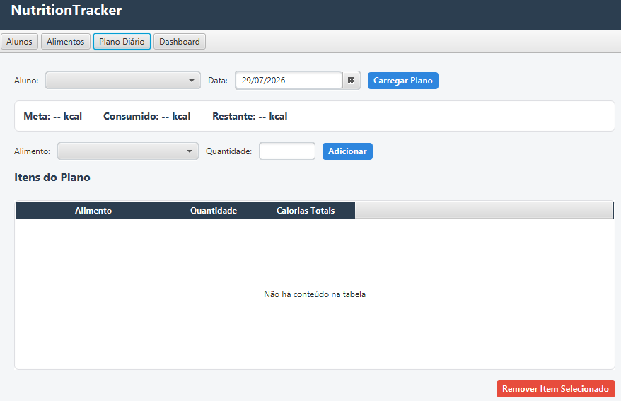
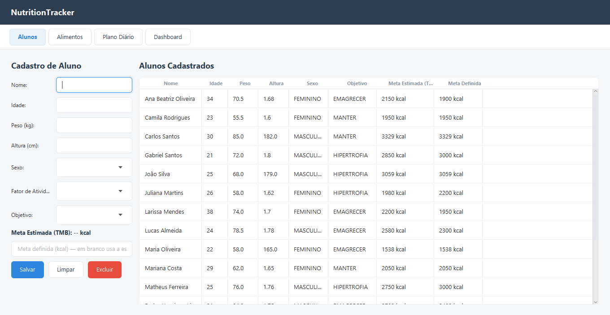
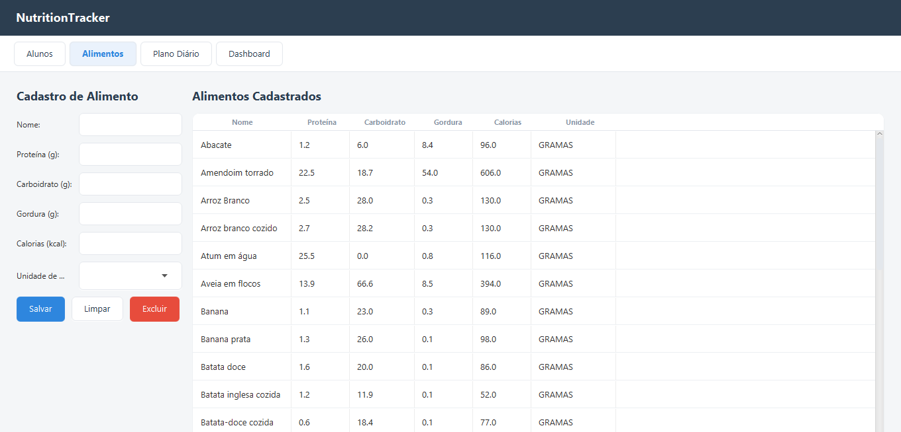
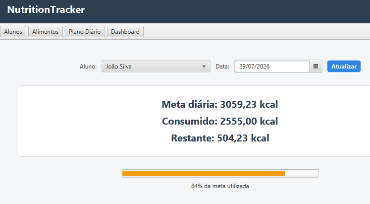

# Nutrition Tracker

Sistema de acompanhamento nutricional para profissionais de nutrição gerenciarem alunos, planos alimentares e metas calóricas. Cliente desktop em JavaFX já funcional; API REST em Spring Boot em desenvolvimento, consumindo o mesmo núcleo de domínio.



<details>
<summary>Ver mais telas</summary>

| Alunos | Alimentos |
|---|---|
|  |  |

| Dashboard |
|---|
|  |

</details>

---

## Funcionalidades

* Cadastro de alunos com cálculo automático de meta calórica (TMB) e ajuste manual pelo profissional
* Cadastro de alimentos com informações nutricionais por unidade de medida
* Montagem de plano alimentar diário, com validação de meta calórica e mesclagem automática de itens repetidos
* Dashboard com resumo do consumo do dia e barra de progresso visual

---

## Arquitetura

Monorepo multi-módulo Maven, separando domínio de negócio dos clientes que o consomem:

```
nutrition-tracker/
├── nutrition-tracker-core/       → entidades, repositórios e regras de negócio
├── nutrition-tracker-desktop/    → cliente JavaFX (depende de core)
└── nutrition-tracker-api/        → API REST em Spring Boot (depende de core, em construção)
```

`core` não depende de UI nem de web — concentra entidades JPA, repositórios Spring Data e services reutilizáveis por qualquer cliente.

Fluxo de camadas dentro de cada cliente:
```
Controller → Service → Repository (Spring Data JPA) → MySQL
```
Schema versionado via Flyway; persistência via Hibernate.

---

## Tecnologias

Java 17 · Spring Boot 3 · Spring Data JPA / Hibernate · Flyway · MySQL 8 · Maven (multi-módulo) · JavaFX · Lombok · JUnit 5

---

## Como executar

```bash
git clone https://github.com/<seu-usuario>/nutrition-tracker.git
cd nutrition-tracker
cp nutrition-tracker-desktop/src/main/resources/application-example.yml nutrition-tracker-desktop/src/main/resources/application.yml
# edite o application.yml com suas credenciais de banco — schema é criado automaticamente pelo Flyway
mvn clean install
cd nutrition-tracker-desktop && mvn javafx:run
```

---

## Limitações conhecidas

* Sem paginação nas tabelas — adequado ao volume atual, próximo ponto de otimização em caso de crescimento
* Single-tenant e sem autenticação — decisão deliberada de escopo, com autenticação planejada para quando a API for exposta
* Metas de macronutrientes por aluno ainda não são configuráveis — acompanhamento hoje é só informativo

---

## Roadmap

* [x] Migração de JDBC puro para Spring Data JPA / Hibernate
* [x] Versionamento de schema com Flyway
* [x] Reestruturação em módulos Maven (core / desktop / api)
* [ ] API REST em Spring Boot — em andamento
* [ ] Autenticação via Spring Security + JWT
* [ ] Metas de macronutrientes por aluno
* [ ] Pipeline de CI (GitHub Actions)

---

## Decisões técnicas

* Persistência começou em JDBC puro, de propósito, para entender o que um ORM abstrai antes de migrar.
* Meta calórica separada em **estimada** (calculada) e **definida** (ajustável) — a fórmula de TMB é referência, não imposição sobre o critério clínico do profissional.
* Lock otimista (`@Version`) em `PlanoDiario` para lidar com concorrência na adição de itens.

---

## Autor

Desenvolvido por **[Vitor Henrique]** como projeto de estudo em Java/Spring, com foco em arquitetura em camadas e boas práticas de backend.

[LinkedIn](https://www.linkedin.com/in/vitor-henrique-deva61412/) · [GitHub](https://github.com/Snapev22)
